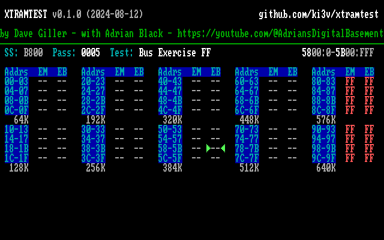
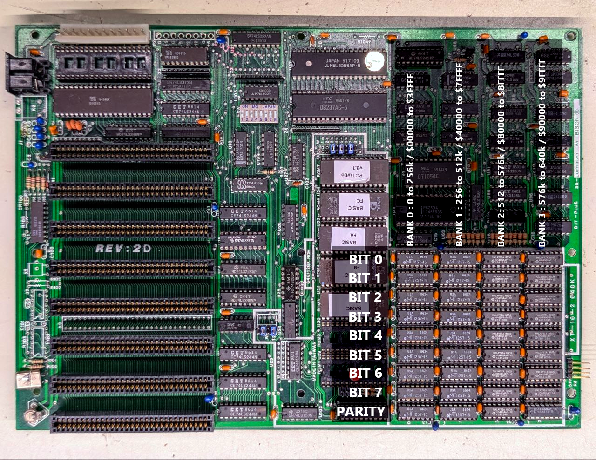

# RAM test ROM for IBM PC/XT and Clones

by David Giller and Adrian Black

See the YouTube video on [Adrian's Digital Basement](https://youtube.com/@adriansdigitalbasement) ([direct video link](https://youtu.be/KcrMssDp8Mo?si=5GnlTwxYQo68uhtq))

This is a diagnostic ROM for testing RAM in an IBM PC/XT computer or clone.  It is used by temporarily replacing the BIOS ROM in your machine with this code programmed onto an EPROM chip, which will boot directly into the RAM testing program without requiring functioning RAM or file storage.  It does currently require a CGA or MDA adapter both for reporting and for using the video RAM on these cards, allowing testing of every byte of conventional RAM in your system.

The ROM currently performs two types of RAM test:

- The [March-U](https://www.researchgate.net/publication/3349024_March_U_A_test_for_unlinked_memory_faults) algorithm, which is a carefully arranged sequence of sequential reads and writes across the whole memory space looking for faults that result in memory corruption, even where reads/writes to one location cause corruption somewhere else in memory.  This is a common kind of RAM fault that is difficult to detect using simpler testing algorithms.

- Bit pattern and address/data bus exercise testing based on ideas published by [Jack Ganssle](https://www.ganssle.com/testingram.htm).  While just reading and writing bit patterns (the traditional `AA`, `55`, etc. values used by older RAM tests) are of limited value because of the many kinds of RAM faults they don't reliably detect, Ganssle describes in the link above how to aggressively exercise the address and data busses to attempt to expose hardware that may work under simple testing but will fail under heavier load or more challenging sequences of events.

The ROM does not currently test parity RAM or the parity checking circuit. Parity is disabled at all times.

## Using this ROM to test RAM in your PC/XT or clone

There are three ways to use this ROM to test RAM in your computer.

### Method 1: Replacing the system BIOS with the XTRAMTEST ROM

The first way of using this ROM is to pull out your system BIOS ROM chip and temporarily replace it with an EPROM programmed with one of our ROM images.

Two images are included in the Releases (see the right side of the GitHub project page): `xtramtest.8k` is an 8K binary image for burning into a 2764/2864 or equivalent 64Kbit/8Kbyte E(E)PROM, and `xtramtest.32k` is a 32K image for burning into a 27256/28256 or equivalent 256Kbit/32Kbyte E(E)PROM.  

You may want to remove all other ISA cards (besides the video card) and remove all the other ROM chips from the system before running this ROM, just to eliminate any potential issues.

The Keyboard or any other peripherals are not tested or needed to run this ROM. Currently the speaker is not used either other than to beep at the beginning to signal that the ROM has started, although beep code support may be added in the future.

There are a few different ways to use this ROM, depending on your hardware. Installing this ROM is generally similar to using the SuperSoft/Landmark Diagnostic and Ruud's Diagnostic ROM for the IBM PC and PC XT. This link on minuszerodegrees.net describes the nuance of getting this running on various IBM machines:

[Supersoft/Landmark Diagnostic ROM's for IBM 5150/5155/5160/5162/5170](https://www.minuszerodegrees.net/supersoft_landmark/Supersoft%20Landmark%20ROM.htm)

When using in the system BIOS ROM socket, this ROM currently only works with IBM MDA (and compatible) cards and IBM CGA (and compatible) cards. It will not work with EGA or VGA (or compatible) cards.  EGA/VGA type cards require their own BIOS routines to initialize, which requires working RAM in the lowest bank.

I have successfully run the XTRAMTEST ROM in option ROM mode with only an EGA card installed, but your experience may vary.  See below.

#### As system BIOS replacement in the IBM PC 5150

This machine uses 2364 mask ROMs. These sockets are not compatible with 2764/2864 chips and you must use an adapter. Use an adapter that goes from 2764/2864 to the 2364 and use the `xtramtest.8k` binary available under Releases. See this link:

[IBM 5150 motherboard  -  Use of '2364 Adapter'](https://minuszerodegrees.net/5150/motherboard/IBM%205150%20motherboard%20-%20Use%20of%202364%20adapter.htm)

#### As system BIOS replacement in the IBM PC/XT 5160

This machine uses normal ROMs which are compatible with 27C256 (32KB) EPROMs. Download the `xtramtest.32k` Binary and put that onto a 27C256 EPROM and install into U18. See these links for more information:

[Ruud's diagnostic ROM fitted to the 64-256KB version of IBM 5160 motherboard](https://minuszerodegrees.net/ruuds_diagnostic_rom/5160/64-256KB.htm)
[Ruud's Diagnostic ROM fitted to the 256-640KB version of IBM 5160 motherboard](https://minuszerodegrees.net/ruuds_diagnostic_rom/5160/256-640KB.htm)

#### As system BIOS replacement in PC/XT-class clones

These machines usually use 2764 or sometimes 27128 EPROMs. If it uses a 2764, you can use a 2864 in place of the original BIOS and flash the 8k image onto it. On machines using a 27128, you will need to load the 8k image into the 16k eprom twice before you burn the EPROM.  See also:

[Ruud's diagnostic ROM fitted to PC and XT clones](https://minuszerodegrees.net/ruuds_diagnostic_rom/clones/clones.htm)

### Method 2: Installing as an "option ROM"

The second way this ROM can be used is by installing it as an "option ROM".  The exact method of preparing a ROM chip will vary (and is currently left as an exercise for the reader, as they say), but it is the same as preparing any other option ROM such as XT-IDE.

Once the EPROM is prepared, it can be installed in any option ROM socket on the motherboard.  Depending on your BIOS, you may be able to install the option ROM in the BASIC ROM socket (which will generally be empty on clones and filled on actual IBM PC/XT computers).

Then, when booting any BIOS that supports option ROMs, the BIOS will initialize this ROM, which will install itself as a warm start handler, and when the BIOS attempts to boot the operating system, this BIOS will print a message asking you to press the T key to start RAM tests, or any other key (or just wait a few seconds) to continue booting.

If there are other boot-providing option ROMs in the system (such as XT-IDE or network cards with boot ROMs) which are loaded at higher addresses, they will be given an opportunity to boot first, and they may not permit the XTRAMTEST ROM a chance to take over, so you may have to remove other cards in order to get this ROM to run in option ROM mode.

#### Disadvantages of installing XTRAMTEST as an option ROM

Please understand that while installing as an option ROM can be convenient (the machine can either run the RAM tests or boot to DOS without swapping RAM chips), there are significant disadvantages to running it this way.

Foremost of these disadvantages is that the BIOS will run its RAM test first, and generally if it detects bad RAM, it will refuse to boot.

If you do have bad RAM in the first bank that the BIOS _doesn't_ detect, it will use low portions of RAM to perform its initializations, storing variables and its program stack there.  If any memory corruption occurs during this time, the machine may crash or misbehave in other ways, possibly preventing the RAM tests from starting or from working properly.

Additionally, not all BIOSes support option ROMs (early IBM PC and XT BIOSes did not) and we have not had universal success even with BIOSes that do support option ROMs.

The most reliable results will be obtained by replacing the system BIOS ROM with XTRAMTEST for testing.

However, if you do not have a working MDA or CGA card available, and your first bank of RAM is working well enough to initialize the option ROM, you _may_ be able to get the XTRAMTEST working as an option ROM with EGA/VGA type cards.

### Method 2: Running as a program from DOS

Finally, a DOS program called `LOADXTRT.COM` is provided.  This is a very simple program that will load the ROM image into an unused section of video RAM if it can find it, then launch the ROM from there.

This is an easy way to try out the RAM test, or to run it when it is difficult or inconvenient for you to create a ROM chip from one of the provided images.

`LOADXTRT.COM` is probably the method of launching XTRAMTEST most compatible with EGA/VGA cards, as they are fully initialized by their video BIOS before the RAM test is even loaded.

#### Disadvantages of running XTRAMTEST using `LOADXTRT.COM` from DOS

The same disadvantages as running as an option ROM apply to running as a DOS program, only more so.  Your system must be fairly stable to begin with, and able to boot to DOS and load programs from some kind of storage.

As such, this is primarily useful if you have a machine that runs, but you suspect there are marginal or intermittent RAM chips.

## Memory layout of a typical PC/XT clone motherboard

See also the video linked above for further discussion on how to find the problematic RAM chips on your board.

The RAM layout of various clone machines can vary greatly, so make sure to determine if your board differs from what is shown here.

## Modifying/Building the ROM

Prerequisites for building:

- Gnu Make
- [NASM](https://www.nasm.us)
- Perl (any reasonably modern version).  There are no module dependencies other than what ships with Perl.

Just type `make` to build the ROM.  Both `nasm` and `perl` should be in your `$PATH`.

This ROM is assembled using NASM.  Tested with version NASM version 2.16.03, but any reasonably modern version should work.

As part of the option ROM image file preparation, a checksum is calculated, and this is inconvenient to do in a cross-platform way.  Currently this and a couple other housekeeping tasks are accomplished using Perl scripts.  Perl should be installed by default under Linux, Mac, or the Windows WSL Linux environment.

Build instructions will be forthcoming, but look in the `tools` directory for the scripts used to build the binaries and test under MAME emulation.

## Acknowledgements and dedication

- This ROM was made possible by starting with [Ruud's Diagnostic ROM](https://www.minuszerodegrees.net/ruuds_diagnostic_rom/clones/clones.htm), by Ruud Baltissen and modem7, at minuszerodegrees.net.  As seen above, we also rely extensively on their well-researched documentation.

- The compact initialization code is from the [Super PC/Turbo XT BIOS](https://github.com/virtualxt/pcxtbios), which is public domain.

## License

This project is currently licensed under the GNU Public License version 2.  It includes original code copyright (C) David Giller (myself) and also makes use of code that is, as far as I can tell, released to the public domain.
